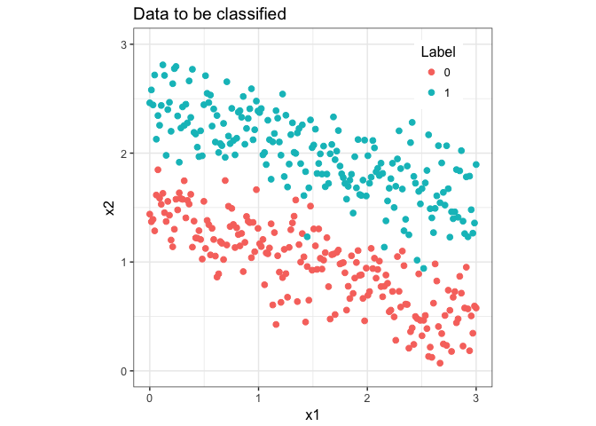
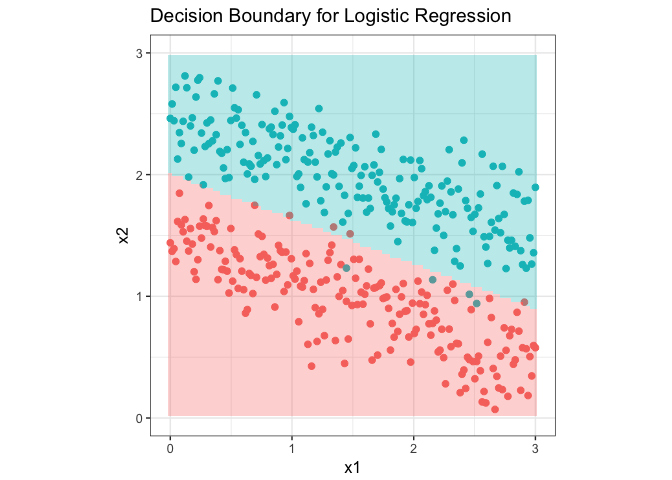

Understanding Logistic Regression from Scratch
================
Jun
Dec 29, 2019

Introduction
------------

In statistics and data science, logistic regression is used to predict the probability of a certain class or event. Usually, the model is binomial, but can also extend to multinomial. It probably is one of the simplest yet extremely useful models for a lot of applications, with its fast implementation and ease of interpretation.

This post will focus on the binomial logistic regression (with possible follow up on a multinomial model). I will discuss the basics of the logistic regression, how it is related to linear regression and how to construct the model in `R` using simply the matrix operation. Using only math and matrix operation (not the built-in model in `R`) will help us understand logistic regression under the hood.

Finally, I will use the constructed model to classify some generated data and show the decision boundary.

Logistic regression
-------------------

We can think logistic regression is a generalized linear model, with a binominal distribution and a logit link function. This similarity with linear regression will help us construct the model. However the difference between the two models is that: in linear regression, the range of predicted value is (−∞, ∞), while in logistic regression, it is the probability *p* ranging \[0, 1\]. That’s why we need to use the logit link function.

Instead of predicting *p* directly, we predict the log of odds (logit):

$\\mathrm{logit}(p) = \\log(\\frac{p}{1-p})$,

which has a range from −∞ to ∞. When *p* → 0, logit(*p*) → −∞ and when *p* → 1, logit(*p*) → ∞. As a result, the logit function effectively maps the probability values from \[0, 1\] to (−∞, ∞). Now the linear relationship is:

$\\log(\\frac{p^{(i)}}{1-p^{(i)}})=\\theta\_0 + \\theta\_1x\_1^{(i)} + \\theta\_2x\_2^{(i)} + … ,$

where the superscript denotes the *i*th example, and the subscript denotes the feature or predictors *x*<sub>1</sub>, *x*<sub>2</sub> etc ( *x*<sub>0</sub> is 1 as bias). For total of m training examples, the shape of the predictor matrix X will be m×(D+1), where D is the dimensionality of the predictor variables ( *x*<sub>1</sub>, *x*<sub>2</sub>, …, *x*<sub>*D*</sub>). Adding 1 is to include the bias column *x*<sub>0</sub>.

And (*θ*<sub>0</sub>, *θ*<sub>1</sub>, *θ*<sub>2</sub>, …, *θ*<sub>*D*</sub>) is a (D+1)×1 column vector. To vectorize the calculation, the right hand side (RHS) can be written as transpose(*θ*)⋅*X* or *X*⋅*θ*. Next the task is to find *θ*, which best represents the variation in *p* with varying *X* amongst *m* training examples. To find *θ*, we need to define a cost function. The cost function is such that every incorrect prediction (or further away from the real value) will increase its value. In logistic regresion, the cost function is defined as:

$J=-\\frac{1}{m}\\sum\_{i=1}^m(y^{(i)}\\log(h(x^{(i)}))+(1-y^{(i)})\\log(1-h(x^{(i)})))$

where *h*(*x*) is the sigmoid function, inverse of logit function:

$h(x)=\\frac{1}{1+e^{-x\\cdot\\theta}}$

For every example, *y* is the actual class label 0 or 1, and *h*(*x*) is the predicted probability of getting the value of 1. If *y* = 1 (the second term with (1 − *y*) will be 0), *J*<sup>(*i*)</sup> = −*y* ⋅ *l**o**g*(*h*(*x*)). When *h*(*x*)→1, *J**J*<sup>(*i*)</sup> → 0 since log(1)=0; when *h*(*x*)→0, *J*<sup>(*i*)</sup> → ∞. If *y* = 0, *J*<sup>(*i*)</sup> = −*l**o**g*(1 − (*h*(*x*))). When *h*(*x*)→0, *J*<sup>(*i*)</sup> → 0, when *h*(*x*)→1, *J*<sup>(*i*)</sup> → −∞. As *h*(*x*) furthers from *y*, the cost function increases rapidly.

This is the basic process to construct the model. Surprisingly it is simpler than I thought when I start coding.

Model construction in R
-----------------------

Now that we have the math part, let’s build our logistic regression. First I will define helper functions such as the sigmoid function, cost function *J* and the gradient of *J*. Note `%*%` is the dot product in `R`. All the functions below uses vectorized calculations.

``` r
library(ggplot2)
library(dplyr)

#sigmoid function, inverse of logit
sigmoid <- function(z){1/(1+exp(-z))}

#cost function
cost <- function(theta, X, y){
  m <- length(y) # number of training examples
  h <- sigmoid(X %*% theta)
  J <- (t(-y)%*%log(h)-t(1-y)%*%log(1-h))/m
  J
}

#gradient function
grad <- function(theta, X, y){
  m <- length(y) 
  
  h <- sigmoid(X%*%theta)
  grad <- (t(X)%*%(h - y))/m
  grad
}
```

Next is the logistic regression fuction, which takes training data *X*, and label *y* as input. It returns a column vector which stores the coefficients in *t**h**e**t**a*. One thing to pay attention to is that the input *X* usually doesn’t have a bias term, the leading column vector of 1, so I added this column in the function.

``` r
logisticReg <- function(X, y){
  #remove NA rows
  X <- na.omit(X)
  y <- na.omit(y)
  #add bias term and convert to matrix
  X <- mutate(X, bias =1)
  #move the bias column to col1
  X <- as.matrix(X[, c(ncol(X), 1:(ncol(X)-1))])
  y <- as.matrix(y)
  #initialize theta
  theta <- matrix(rep(0, ncol(X)), nrow = ncol(X))
  #use the optim function to perform gradient descent
  costOpti <- optim(theta, fn = cost, gr = grad, X = X, y = y)
  #return coefficients
  return(costOpti$par)
}
```

Finally, I can write two prediction functions: first one predicts the probability *p* with *X* and *t**h**e**t**a* as input, the second one returns *y* (1 or 0) with *p* as input.

``` r
# probability of getting 1
logisticProb <- function(theta, X){
  X <- na.omit(X)
  #add bias term and convert to matrix
  X <- mutate(X, bias =1)
  X <- as.matrix(X[,c(ncol(X), 1:(ncol(X)-1))])
  return(sigmoid(X%*%theta))
}

# y prediction
logisticPred <- function(prob){
  return(round(prob, 0))
}
```

Classification and decision boundary
------------------------------------

The training data is generated such that it has two classes (0, 1), two predictors (*x*<sub>1</sub>, *x*<sub>2</sub>) and can be separated by a linear function.

``` r
N <- 200 # number of points per class
D <- 2 # dimensionality, we use 2D data for easy visulization
K <- 2 # number of classes, binary for logistic regression
X <- data.frame() # data matrix (each row = single example, can view as xy coordinates)
y <- data.frame() # class labels

set.seed(56)

for (j in (1:K)){
  # t, m are parameters of parametric equations x1, x2
  t <- seq(0,1,length.out = N) 
  # add randomness 
  m <- rnorm(N, j+0.5, 0.25) 
  Xtemp <- data.frame(x1 = 3*t , x2 = m - t) 
  ytemp <- data.frame(matrix(j-1, N, 1))
  X <- rbind(X, Xtemp)
  y <- rbind(y, ytemp)
}

# combine the data
data <- cbind(X,y)
colnames(data) <- c(colnames(X), 'label')

# visualize the data:
ggplot(data) + geom_point(aes(x=x1, y=x2, color = as.character(label)), size = 2) + 
  scale_colour_discrete(name  ="Label") + 
  ylim(0, 3) + coord_fixed(ratio = 1) +
  ggtitle('Data to be classified') +
  theme_bw(base_size = 12) +
  theme(legend.position=c(0.85, 0.87))
```



There is some slight overlap so no such line will perfectly separate the two classes. However, our model shall still be able to find the best line.

Now I can train the model to get *t**h**e**t**a*.

``` r
# training
theta <- logisticReg(X, y)

# generate a grid for decision boundary, this is the test set
grid <- expand.grid(seq(0, 3, length.out = 100), seq(0, 3, length.out = 100))
# predict the probability
probZ <- logisticProb(theta, grid)
# predict the label
Z <- logisticPred(probZ)
gridPred = cbind(grid, Z)
```

A grid is also created, which can be seen as a test set. The trained model will be applied to this grid, and predict the outcome Z. This can be used to create a decision boundary.

``` r
# decision boundary visualization
ggplot() +   
  geom_point(data = data, aes(x=x1, y=x2, color = as.character(label)), size = 2, show.legend = F) + 
  geom_tile(data = gridPred, aes(x = grid[, 1],y = grid[, 2], fill=as.character(Z)), 
            alpha = 0.3, show.legend = F) + ylim(0, 3) +
  ggtitle('Decision Boundary for Logistic Regression') +
  coord_fixed(ratio = 1) +
  theme_bw(base_size = 12) 
```



In the plot above, the model predicts a boundary that separates most of the two classes. Some data points are not correctly predicted as expected. However, a model that makes 100% prediction on the training data may not be a good one most of the time, as it overfits the data. In fact based on how I generated the data, the analytical solution should be *x*/3 + *y* = 2. And my decision boundary is very close to this analytical line.

Conclusion
----------

There you have it, it is not that hard for ourselves to build a regression model from scratch. If you follow this post, hopefully by now, you have a better understanding of logistic regression. One last note, although logistic regression is often said to be a classifier, it can also be used for regression: to find the probability as we see above.
